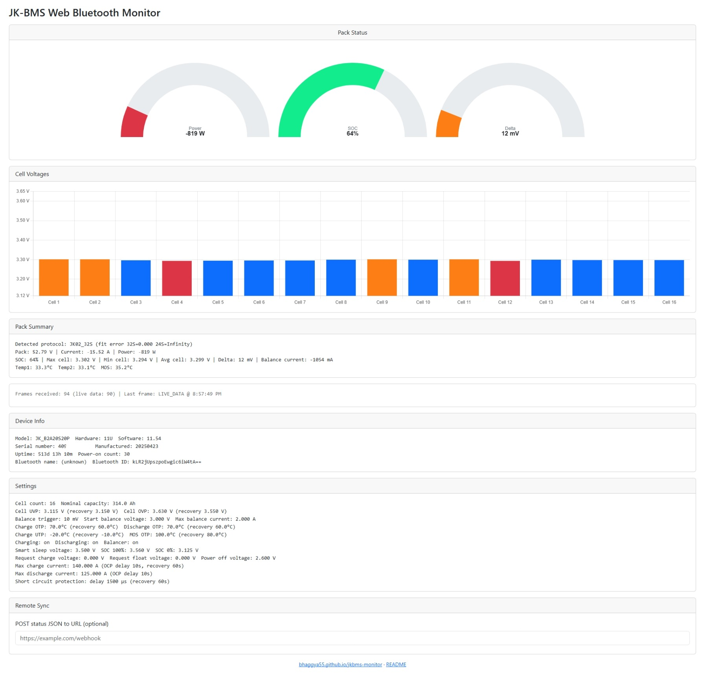

# JK-BMS Web Bluetooth Monitor

A single-page, offline-capable web app that connects to a JK-BMS battery
management system over Web Bluetooth and displays live cell voltages,
pack power, state of charge, cell-voltage delta, device info, and the
BMS's full configuration (settings). No app install, no firmware flashing,
no gateway hardware — just open a web page and connect directly from your
phone or laptop.

Live site: <https://bhaggya55.github.io/jkbms-monitor>

[](https://github.com/bhaggya55/jkbms-monitor/releases/latest)
[](https://github.com/bhaggya55/jkbms-monitor/releases/latest)



## Why this tool?

Most existing JK-BMS tools solve the "get data out of the BMS" problem by
putting another device in the middle — an ESP32 running custom firmware, a
Raspberry Pi/Victron GX device, or a PC running a Python/CLI utility. That
extra hardware is great for **permanent, unattended monitoring** (e.g.
Home Assistant dashboards or Victron VRM), but it's overkill when you just
want to:

- **Check a pack in the field** — sizing up a used/DIY battery at a
  swap meet, verifying cell balance after a repair, or troubleshooting a
  pack that's misbehaving — with nothing but the phone already in your
  pocket, no soldering or flashing required.
- **Bench-test or commission a new pack** — see live cell voltages and
  settings immediately after wiring up a BMS, before deciding whether it's
  worth integrating into a permanent monitoring stack at all.
- **Read or sanity-check BMS settings** without a serial cable, a second
  microcontroller, or installing a Python environment — this app decodes
  the full SETTINGS frame (protection thresholds, balance config, OCP/OTP/
  UTP with recovery values, etc.) straight from the browser.
- **Share a live view with someone else** in seconds — the Remote Sync
  feature can `POST` a JSON snapshot to any webhook URL (e.g. a spreadsheet,
  a Discord webhook, or your own logging endpoint) without writing a
  dedicated integration.

Because it's a static page with everything vendored locally, it also works
**completely offline** once loaded, and can be self-hosted, forked, or run
straight from disk (`file://`) with no build step, server, or account.

If you need 24/7 unattended logging, Home Assistant integration, or Victron
GX/VRM integration, the other tools in the table below are a better fit —
see [Comparison with other tools](#comparison-with-other-tools).

## Features

- **Pack Status** — power, SOC, and cell-voltage-delta gauges.
- **Cell Voltages** — a live bar chart of every active cell, with the
  min/max cells highlighted.
- **Pack Summary** — pack voltage/current/power, temperatures, and balance
  current as text.
- **Device Info** — model, hardware/software version, serial number,
  manufacturing date, uptime, power-on count, and the browser-assigned
  Bluetooth identifier (`device.id`/`device.name` — Web Bluetooth
  deliberately hides the real BLE MAC address from web pages, so this is
  the closest available identifier).
- **Settings** — nearly every field from the BMS's SETTINGS frame:
  voltage protection thresholds (UVP/OVP with recovery), balance settings,
  charge/discharge current limits with OCP delay/recovery, over/under
  temperature protection with recovery, short-circuit protection timing,
  and (on JK02_32S packs) extended fields like device address, precharge
  time, and heating settings.
- **Remote Sync** — optionally POST a combined JSON snapshot of Device
  Info, Settings, and Live Data to a URL of your choice on every refresh.
- Auto-reconnect with exponential backoff if the connection drops.
- Only requests live data if the BMS hasn't already streamed it on its
  own in the last 5 seconds, to avoid duplicate frames.

## Usage

Open [index.html](index.html) in a Chromium-based browser
(Chrome or Edge) that supports the Web Bluetooth API, then click **Connect
to JK-BMS** and select your BMS from the device picker. The Pack Status,
Cell Voltages, Pack Summary, and Remote Sync cards appear once connected
and hide again on disconnect; Device Info and Settings appear as soon as
the BMS reports them.

All dependencies (Bootstrap, Chart.js) are vendored locally under `vendor/`
so the page works fully offline — no CDN or internet connection required.

### Remote Sync (webhook)

Enter a URL in the **Remote Sync** card's textbox to have the app `POST` a
JSON payload — `{ deviceInfo, settings, liveData, timestamp }` — to that
URL every time the live data refreshes. The response (or any request
error) is shown in the status area below the textbox; nothing pops up as
an alert. Leave the field empty (or enter an invalid URL) to disable
sending — no request is made and no JSON is even built in that case. The
URL is saved in the browser's `localStorage` and restored automatically
the next time you load the page.

### Auto-reconnect on page reload

The page can automatically reconnect to a previously-paired device on
load, using `navigator.bluetooth.getDevices()`. This API may require
launching Chrome/Edge with:

```
--enable-features=WebBluetoothNewPermissionsBackend
```

(close all browser windows first). Without it, click **Connect** manually
after each reload.

## Comparison with other tools

The JK-BMS community has produced several excellent tools over the years,
each aimed at a different use case. This project focuses on **zero-install,
in-the-moment monitoring from a browser**; the others below focus on
**always-on, unattended integration** with home automation or off-grid
power systems.

| Project | What it is | Hardware needed | Interface | License |
| --- | --- | --- | --- | --- |
| **jkbms-monitor** (this project) | Static web page using the Web Bluetooth API | None — any Chromium browser (desktop or Android) | Live gauges/charts in-browser, webhook sync | GPL-3.0 |
| [syssi/esphome-jk-bms](https://github.com/syssi/esphome-jk-bms) | ESPHome component for JK-BMS | ESP32/ESP8266 flashed with custom firmware | Home Assistant dashboard | Apache-2.0 |
| [mr-manuel/venus-os_dbus-serialbattery](https://github.com/mr-manuel/venus-os_dbus-serialbattery) (successor to the archived [Louisvdw/dbus-serialbattery](https://github.com/Louisvdw/dbus-serialbattery)) | Battery driver for Victron Venus OS | Victron GX device or Raspberry Pi running Venus OS | Victron GX display / VRM Portal | AGPL-3.0 |
| [jblance/mpp-solar](https://github.com/jblance/mpp-solar) (JK-BMS support, successor to [jblance/jkbms](https://github.com/jblance/jkbms)) | Python CLI/daemon for solar inverters and BMS devices | Any OS with Python + a BLE/serial adapter | Command line, MQTT, Prometheus | MIT |
| [sshoecraft/jktool](https://github.com/sshoecraft/jktool) (archived) | Linux command-line utility for JIKONG BMS | Linux host with Bluetooth/CAN/serial adapter | Command line, JSON output | BSD-3-Clause |

Pick **jkbms-monitor** for quick, ad-hoc checks with nothing but a browser.
Pick one of the others if you need permanent logging, Home Assistant
sensors/automations, or Victron GX/VRM integration.

## Credits

This project would not have been possible without the prior reverse-engineering
work of the JK-BMS open-source community. In particular:

- **[syssi/esphome-jk-bms](https://github.com/syssi/esphome-jk-bms)** — the
  primary reference for this project. Its
  [`jk_bms_ble.cpp`](https://github.com/syssi/esphome-jk-bms/blob/main/components/jk_bms_ble/jk_bms_ble.cpp)
  decoder and [protocol documentation](https://github.com/syssi/esphome-jk-bms/blob/main/docs/protocol-design-ble.md)
  were the direct source used to work out the JK02 BLE frame layout, byte
  offsets, and scaling factors for the DEVICE_INFO, SETTINGS, and LIVE_DATA
  frames decoded by this app. Without that documentation, decoding the
  (otherwise undocumented) SETTINGS frame in particular would have taken
  far longer.
- **[jblance/jkbms](https://github.com/jblance/jkbms)** (now part of
  [jblance/mpp-solar](https://github.com/jblance/mpp-solar)) and
  **[sshoecraft/jktool](https://github.com/sshoecraft/jktool)** — early,
  independent efforts to reverse-engineer JK-BMS Bluetooth communication
  that, per `esphome-jk-bms`'s own references, helped establish the public
  groundwork this whole ecosystem of tools (including this one, transitively)
  builds on.

If you maintain one of these projects and want the credit here adjusted,
please open an issue.

## License

This project is licensed under the **GNU General Public License v3.0 (or
later)** — see [LICENSE](LICENSE) for the full text. You are free to use,
study, modify, and redistribute this software, provided that derivative
works are also distributed under the GPLv3 (or a later version) with
source code made available.
